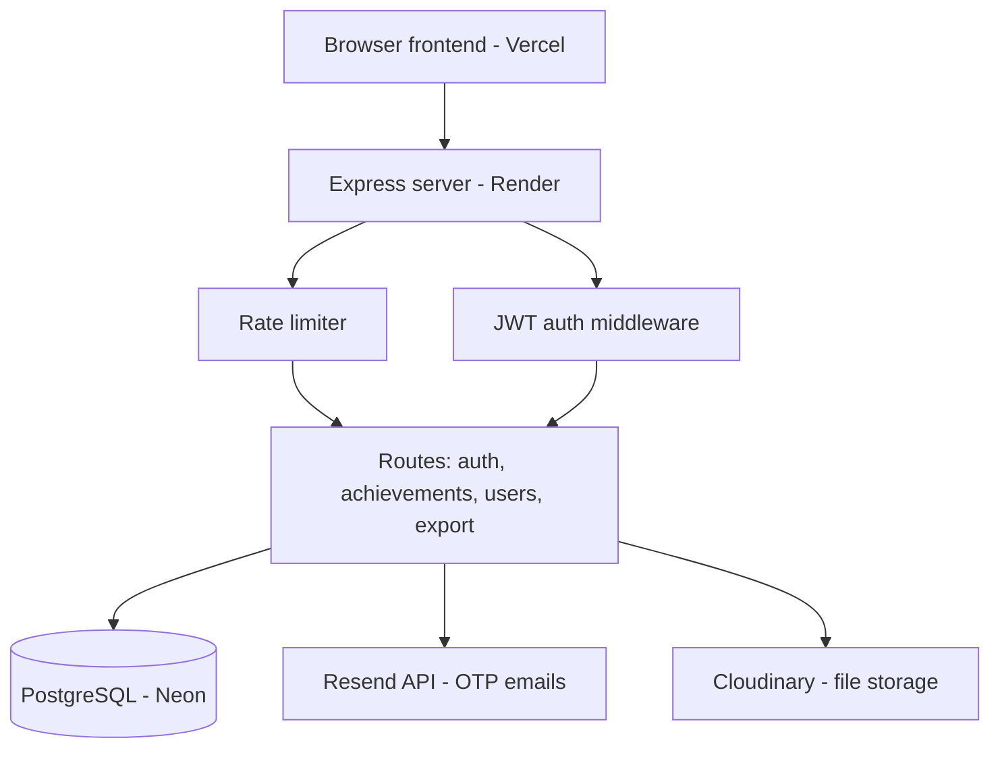

# GITAM Achievements Portal

A full-stack web portal built for GITAM Deemed to be University to track, manage and verify student and faculty achievements. Students upload certificates, faculty and admins review/approve them and can export reports.

**Live demo:** https://achievements-portal-bice.vercel.app


## Screenshots

| Student Dashboard | Faculty Dashboard | Admin Analytics |
|---|---|---|
|  |  |  |

## Architecture



## Features

**Student**
- Sign up/login with GITAM email (`@gitam.in`)
- Submit achievements with certificates, merit letters and proof photos
- Save as draft, submit later
- Track status — verified / pending / rejected

**Faculty**
- View assigned students' submissions
- Verify or reject with remarks
- Export filtered data to Excel

**Admin**
- Dashboard with charts (achievement type breakdown, monthly trend)
- Approve/reject anything, bulk-import users, export Excel/PDF reports

**Security**
- JWT auth, bcrypt password hashing, role-based access control on every route
- Rate limiting on login (10/15min) and general API (150/15min)
- OTP password reset — codes are bcrypt-hashed before storage, expire in 10 min, rate-limited separately
- No default/shared passwords anywhere — bulk-imported accounts get unique random temp passwords
- CORS restricted to Vercel-hosted origins only, parameterised SQL everywhere

## Tech stack

| Layer | Tech |
|---|---|
| Frontend | Vanilla HTML/CSS/JS |
| Backend | Node.js, Express |
| DB | PostgreSQL (Neon) |
| Auth | JWT, bcrypt |
| Email | Resend (HTTP API) |
| File storage | Cloudinary via Multer |
| Charts | Chart.js |
| Reports | ExcelJS, PDFKit |
| Hosting | Render (backend) + Vercel (frontend) |

## Why Resend instead of Gmail SMTP, why Cloudinary instead of local disk

Started with Nodemailer + Gmail SMTP and local disk storage for uploads (`multer.diskStorage`). Both broke in production:

- Render's free tier blocks outbound SMTP on the usual ports, so Gmail kept timing out / throwing `ENETUNREACH`. Switched to Resend, which sends over HTTPS instead of SMTP — no more port issues.
- Render's filesystem is ephemeral. Anything saved to local disk disappears on the next deploy or restart, so uploaded certificates/photos would just vanish. Moved file uploads to Cloudinary so they persist.

Also had to add `app.set('trust proxy', 1)` since Render sits behind a proxy and `express-rate-limit` needs that to read the real client IP from `X-Forwarded-For` correctly.

## Project structure

```
achievements/
├── index.html            # student sign-up
├── login.html
├── forgot-password.html
├── student.html
├── faculty.html
├── admin.html
├── css/style.css
├── js/
│   ├── config.js         # API_BASE
│   ├── login.js
│   ├── forgot-password.js
│   ├── student.js
│   ├── faculty.js
│   └── admin.js
└── backend/
    ├── server.js
    ├── db.js
    ├── middleware/
    │   ├── auth.js
    │   ├── rateLimiter.js
    │   ├── otpLimiter.js
    │   └── upload.js      # Multer + Cloudinary
    ├── utils/mailer.js    # Resend
    ├── migrations/add_password_reset.sql
    └── routes/
        ├── auth.js
        ├── achievements.js
        ├── users.js
        └── export.js
```

## Database

**users** — id, name, email, roll_number, faculty_code, password (bcrypt hash), role (student/faculty/admin), department, batch, year_of_study, faculty_id (FK), reset_otp_hash, reset_otp_expires, reset_otp_attempts

**achievements** — id, user_id (FK), title, event_name, event_type, level, result, position, place_held, organiser_name, start_date, end_date, certificate_url, merit_url, photo_urls (Cloudinary URLs), description, status, remarks, verified_by (FK), verified_at

## API

**Auth** — `POST /api/auth/login`, `/register`, `/forgot-password`, `/verify-otp`, `/reset-password`

**Achievements** — `GET /mine`, `/all` (admin), `/students` (faculty), `/stats` (admin) · `POST /` submit · `PUT /:id` edit · `PATCH /:id/status` verify/reject · `DELETE /:id`

**Users** — `GET /me`, `/students`, `/faculty` · `PUT /:id` · `POST /bulk-import`

**Export** — Excel/PDF endpoints under `/api/export/*`

## Running locally

```bash
cd backend
npm install
```

`.env` in `backend/`:
```
DATABASE_URL=postgresql://...
JWT_SECRET=...
PORT=5000
RESEND_API_KEY=...
CLOUDINARY_CLOUD_NAME=...
CLOUDINARY_API_KEY=...
CLOUDINARY_API_SECRET=...
FRONTEND_URL=http://localhost:5500
```

Run the migration once: `psql "$DATABASE_URL" -f backend/migrations/add_password_reset.sql`

`npm run dev` (nodemon) or `npm start`. Frontend is static, just `npx serve .` or open the HTML files directly — set `API_BASE` in `js/config.js` to wherever your backend is running.

## Deployment

Backend on Render (root dir `backend`, build `npm install`, start `npm start`, env vars in dashboard). Frontend on Vercel — root of repo, update `API_BASE` before deploying. Free tier on Render sleeps after inactivity so the first request after a while can take 30-50s.

## Accounts

Students self-register with `@gitam.in` email. Faculty/admin accounts get created via `/register` or bulk-imported (random temp password per user, nothing shared or hardcoded). Forgot password works for everyone via the OTP flow.

## License

MIT
